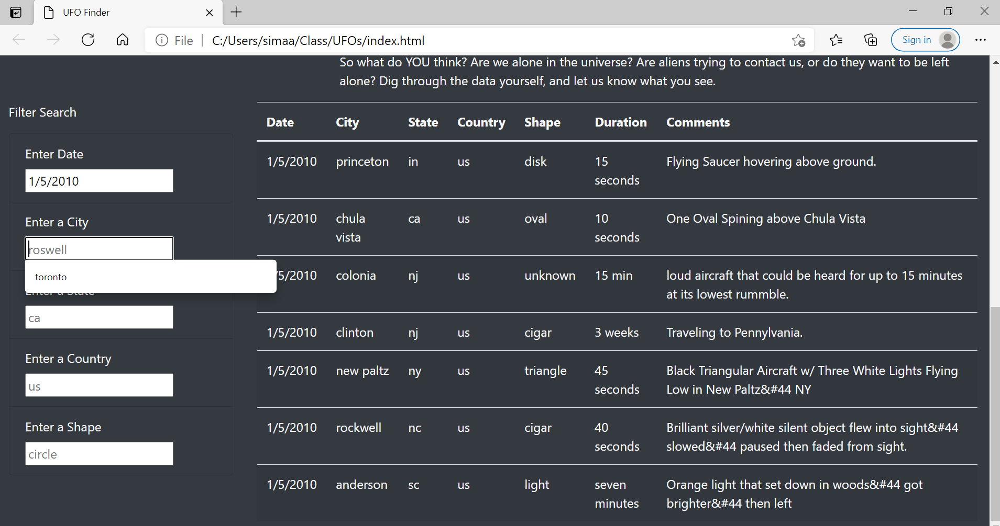
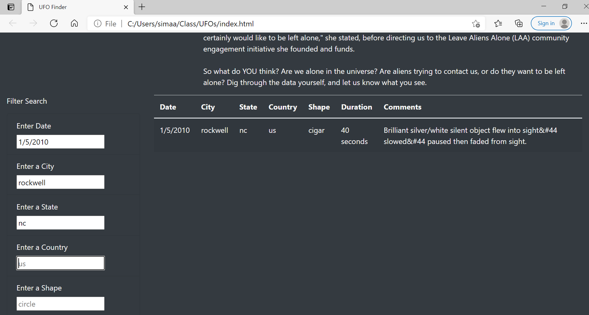

# Overview of Project
The purpose of this project is to create a web page and publish an article about UFOs with showing data on information they have been sighted. To do this, we have a JavaScript fill with the information that needs to be shown on the web page, such as country, city, state, date etc. with the help of JavaScript and HTML we are going to display the article and the data in order to be easy to read and find and be filterable when the user needs that.

## Result
Since the sighting data is huge and the JavaScript file is filled to the brim, we created different search options that has been shown in the table on the page. The performance is shown below:

_Figure 1_ : Only set one filter

_Figure 2_ : Set more filters

## Summary 

### Drawback:
-  If the user has misspelling in their search box the table data just runs to an empty page, it does not recommend or search any close word.

### Recomendation on Improvement : 
- The user should be able to search a close word to what they are looking for, not the exact word.
- There search box can be a dropdown menue of what is already in the JavaScript file.
